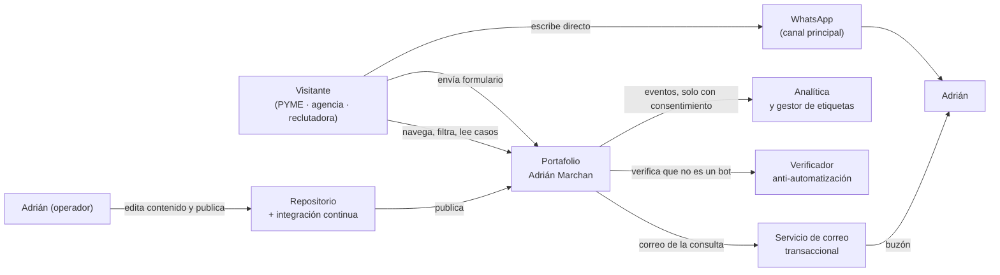

# Arquitectura · Portafolio Adrián Marchan

<!-- Fase 2. Corto y visual. Las decisiones y su justificación están en decisiones/ADR-*.md; aquí solo el resultado. -->

## Estilo arquitectónico

**Sitio generado en el proceso de construcción y servido como archivos estáticos, con un único endpoint de servidor** (el formulario de contacto). Los datos que dependen del visitante —hora local y métricas de su sesión— se calculan en su navegador, en islas pequeñas y declaradas.

Decisiones que lo sostienen: [ADR-001](decisiones/ADR-001-arquitectura-sitio-estatico.md) (arquitectura), [ADR-002](decisiones/ADR-002-framework-astro.md) (Astro 7), [ADR-007](decisiones/ADR-007-alojamiento-cloudflare-ci.md) (alojamiento).

## Diagrama de contexto (C4 nivel 1)



Dentro del sistema: las páginas, el contenido y el endpoint del formulario. Fuera: el servicio de correo, el verificador anti-automatización, la analítica, WhatsApp y la plataforma de alojamiento.

## Contenedores (C4 nivel 2)

| Contenedor | Tecnología | Responsabilidad | Se comunica con |
|---|---|---|---|
| Sitio estático | Astro 7 + TypeScript, generado en build | Servir todas las páginas ya construidas | Navegador del visitante |
| Islas interactivas | TypeScript sobre el DOM + GSAP | Filtros y vistas del listado, consola de comandos, métricas de la sesión, reloj local, banner de consentimiento, formulario | Solo el navegador; ninguna llama al servidor salvo el envío del formulario |
| Endpoint de contacto | Función de servidor (una sola) | Validar, verificar el token anti-bot, limitar la frecuencia y entregar el correo | Servicio de correo, verificador |
| Contenido | Archivos MDX y JSON validados con Zod en el build | Proyectos, servicios, estado del sitio | Se compila dentro del sitio estático |
| Integración continua | GitHub Actions | Verificar y publicar | Plataforma de alojamiento |

## Estructura del repositorio

```text
content/                     # contenido versionado, fuera de src/ (ADR-004)
  projects/                  # un MDX por proyecto (m-000-universe, evox, …)
  services/                  # un MDX por servicio
  site/                      # status.json (disponibilidad y "ahora"), seo.json
public/
  images/{projects,about,brand}/
  fonts/
src/
  pages/                     # una ruta por archivo
    index.astro
    projects/index.astro
    projects/[slug].astro
    services/index.astro
    about.astro · contact.astro · privacy.astro · 404.astro
    api/contact.ts           # EL ÚNICO endpoint de servidor
    sitemap.xml.ts · robots.txt.ts
  layouts/                   # plantillas de página
  components/
    ui/                      # Button, Badge, Tag, Metric, StatusIndicator, Field, Prose
    layout/                  # Container, Section, PageHeader, Header, Footer
    navigation/              # MainNav, MobileNav, CommandPalette, ViewToggle, AnchorNav
    universe/                # UniverseMap, OrbitRing, MissionNode, MissionCard, TrajectoryList
    mission/                 # MissionHeader, TelemetryPanel, MissionSection, Gallery
    sections/                # Hero, Capabilities, GrowthModel, Proof, ClosingCTA, FAQ, Timeline
    forms/                   # ContactForm
    telemetry/               # TelemetryStrip, SessionTelemetry, LocalClock, BuildInfo
    seo/                     # JsonLd y esquemas
  lib/
    content/                 # consultas: getProjects(), getProject(slug), getFeatured()
    analytics/               # events.ts (ÚNICO emisor), consent.ts
    seo/                     # metadata.ts, schema.ts
    motion/                  # registro de GSAP y ajustes compartidos
    utils/
  scripts/                   # islas: filtros, consola, telemetría de sesión, consentimiento
  styles/
    globals.css              # @theme con TODOS los tokens (ADR-003)
  content.config.ts          # colecciones y esquemas Zod (ADR-004)
tests/
  unit/                      # esquemas, filtrado, endpoint, métricas
  e2e/                       # recorrido de contacto, navegación, 404, accesibilidad
astro.config.mjs · tsconfig.json · budget.json · lighthouserc.js
.github/workflows/ci.yml
```

### Reglas de dependencia

1. `src/lib/` **no importa** de `src/components/` ni de `src/pages/`. La dependencia va siempre hacia dentro.
2. Los componentes **no leen contenido directamente**: lo piden a `src/lib/content/`. Así, cambiar el origen del contenido no toca los componentes.
3. **Solo** `src/lib/analytics/events.ts` emite eventos de medición. Está prohibido empujar eventos a la capa de datos desde cualquier otro archivo (ADR-008).
4. Ningún componente escribe valores literales de color, tipografía o espaciado: siempre a través de los tokens de `globals.css` (ADR-003).
5. Cada isla de `src/scripts/` declara explícitamente qué carga. Añadir una isla obliga a comprobar el presupuesto de rendimiento.
6. `content/` no contiene lógica; `src/` no contiene contenido editorial.

## Flujos clave

1. **Visita y contacto directo** (flujo prioritario): petición → archivo estático ya construido → el visitante lee la declaración y pulsa el acceso a WhatsApp, visible sin desplazar (CA-01.1) → conversación fuera del sitio. Sin intervención de servidor.
2. **Envío del formulario**: isla del formulario valida en el navegador → `POST /api/contact` → validación con el mismo esquema en el servidor → verificación del token anti-bot → límite de frecuencia → entrega del correo → respuesta con estado tipado → la isla muestra confirmación o error conservando lo escrito.
3. **Exploración del listado**: la página llega con todos los proyectos ya renderizados; la isla de filtros oculta y muestra sin volver al servidor, y guarda la vista elegida en el dispositivo (CA-03.4).
4. **Medición**: sin consentimiento no se carga nada de analítica. Al consentir, se carga el gestor de etiquetas y los eventos pasan por el módulo único.
5. **Publicación de contenido**: el operador edita un MDX → integra el cambio → la integración continua valida esquemas, formato, tipos, pruebas y presupuesto → publica.

## Datos

No hay base de datos. El contenido son archivos versionados con el código, validados con Zod en el build ([ADR-004](decisiones/ADR-004-contenido-collections-mdx.md)). No se persiste ningún dato personal: las consultas del formulario se entregan por correo y no se almacenan ([ADR-006](decisiones/ADR-006-formulario-correo-antibot.md)).

La **evidencia de las métricas publicadas** (exportaciones del origen y autorización del cliente) se guarda fuera del repositorio publicado, y cada métrica del contenido la referencia (CA-05.2 y CA-05.4).

## Entornos y despliegue

| Entorno | Dónde | Cómo se despliega | Configuración |
|---|---|---|---|
| Desarrollo | local | comando de desarrollo del proyecto | `.env` local, nunca versionado |
| Previsualización | plataforma de alojamiento | automática por cada propuesta de cambio | variables de la plataforma |
| Producción | plataforma de alojamiento | automática al integrar en la línea principal, si la verificación pasa | variables de la plataforma |

Volver atrás: la plataforma conserva las versiones publicadas; revertir no requiere intervención manual sobre datos, porque no hay datos (CA-N04.5).

## Observabilidad

- Registros de la plataforma para el endpoint del formulario.
- Notificación de errores de producción al responsable (CA-N04.4, prioridad Should: si su coste no cabe en el presupuesto, se cumple con revisión semanal de los registros).
- Métricas de experiencia de carga: en laboratorio dentro de la integración continua, y de campo cuando haya volumen suficiente de visitas (nota de E3 en el brief).

## Riesgos técnicos y deuda asumida

| Qué | Por qué se asumió | Cuándo revisarlo |
|---|---|---|
| Consola de comandos implementada a mano, sin biblioteca | React costaba 45 kB del presupuesto solo por existir (ADR-005) | Al implementar RF-12: medir el código propio frente a esos 45 kB |
| Dependencia de un solo proveedor para alojamiento, verificador anti-bot y almacenamiento efímero | Es la única combinación que cumple presupuesto y uso comercial (ADR-007) | Si el proveedor cambia sus condiciones |
| Tope de 100 correos al día en la capa gratuita | Muy por encima del tráfico previsto (ADR-006) | Si los contactos mensuales se acercan a ese volumen |
| La analítica consume ~80 kB, casi la mitad del presupuesto de JavaScript | Solo carga tras el consentimiento, así que no compite con la carga inicial medida (ADR-008) | Si se decide medir sin consentimiento en algún caso |
| Sin repositorio remoto todavía | No bloquea el desarrollo local | Antes de la Fase 7 (entrega) |
