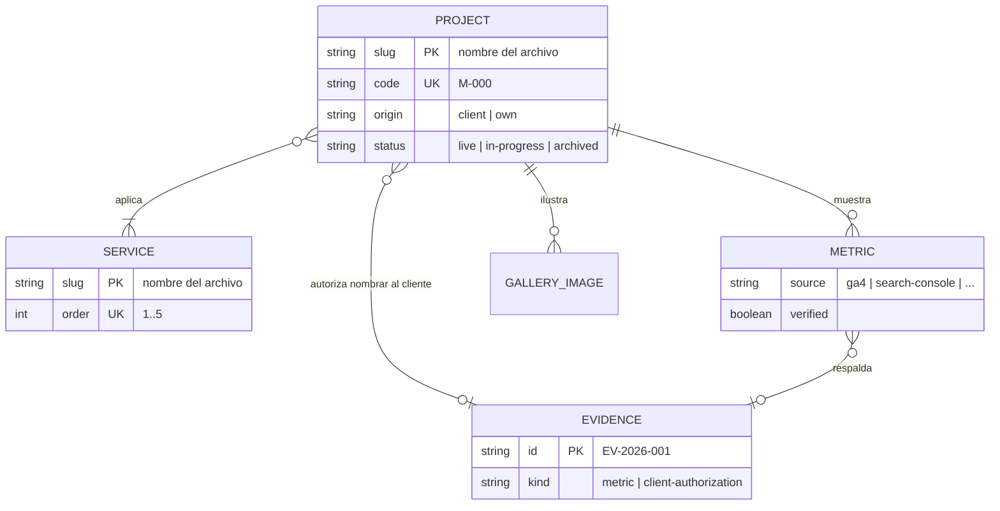

# Modelo de datos · Portafolio Adrián Marchan

<!-- Fase 3. No hay base de datos (ADR-001): el modelo de datos es el MODELO DE CONTENIDO.
     Fuente: archivos en content/, validados con esquemas Zod al construir (ADR-004).
     Se mantiene sincronizado con src/content.config.ts: cambiar un campo aquí obliga a cambiarlo allí en el mismo commit. -->

| Campo | Valor |
|---|---|
| Fecha | 2026-09-26 |
| Estado | Aprobado |
| Requisitos que sostiene | RF-01 a RF-06, RF-08, RF-09, CA-N06.1, CA-N06.2, CA-N07.3 |
| Reglas de la constitución | 13 (regla del dato), 14 (autorización del cliente), 15 (sin datos personales), 16 (contenido solo en `content/`) |

## 1. Principios

1. **El contenido es código**: vive en `content/`, se versiona con el repositorio y se valida al construir. Si un archivo no cumple su esquema, **el build falla** (CA-N06.2).
2. **Tres niveles de validación**, de más a menos automático:
   - **Esquema** por entrada (Zod, en `src/content.config.ts`): tipos, longitudes, formatos, enumerados.
   - **Reglas de colección** (en `src/lib/content/`, al construir): comprobaciones entre entradas o entre colecciones. Fallan el build. §5.
   - **Reglas de lanzamiento** (comando aparte): lo que solo debe cumplirse al publicar por primera vez. No bloquean la integración diaria, para que `main` siga siendo desplegable antes del lanzamiento (regla 30). §6.
3. **Nada del visitante se persiste** (regla 15). Lo único que se guarda en su dispositivo está en §8.
4. **La evidencia no vive en el repositorio** (CA-05.4). El repositorio guarda solo un registro con identificadores que el build puede comprobar (§3.4).

## 2. Diagrama



Además hay seis colecciones de una sola entrada (perfil, estado, perfil extendido, modelo de trabajo, formas de contratación, preguntas frecuentes) sin relaciones entre sí: §3.5 a §3.10.

## 3. Colecciones

| Colección | Archivo(s) | Formato | Cardinalidad | Requisitos |
|---|---|---|---|---|
| `projects` | `content/projects/*.mdx` | MDX | 6 en el MVP | RF-03, RF-04, RF-05, RF-06 |
| `services` | `content/services/*.mdx` | MDX | exactamente 5 | CA-01.2, RF-02 |
| `evidence` | `content/evidence/registry.json` | JSON | una por métrica verificada y por autorización | RF-05, regla 14 |
| `profile` | `content/site/profile.json` | JSON | 1 | CA-01.1, RF-08, CA-09.1, CA-N07.3 |
| `status` | `content/site/status.json` | JSON | 1 | CA-09.3 |
| `about` | `content/site/about.mdx` | MDX | 1 | RF-09 |
| `growthModel` | `content/site/growth-model.json` | JSON | exactamente 4 | CA-01.3 |
| `engagement` | `content/site/engagement.json` | JSON | exactamente 3 | CA-02.4 |
| `faq` | `content/site/faq.json` | JSON | 6 o más | CA-02.5 |
| `seo` | `content/site/seo.json` | JSON | 1 | CA-N07.2, CA-N07.5 |

Los mecanismos concretos de carga (cargadores de Astro por patrón o por archivo) los fija la spec que implemente cada colección.

### 3.1 Project

Identidad: el **nombre del archivo** es el identificador y la dirección: `content/projects/evox.mdx` → `/projects/evox`. En kebab-case, sin tildes.

| Campo | Tipo | Obligatorio | Restricciones | Requisito |
|---|---|---|---|---|
| `code` | string | sí | `^M-\d{3}$`, único. `M-000` reservado al autocaso | CA-03.1 |
| `title` | string | sí | 1–60 caracteres | CA-03.1 |
| `origin` | enum | sí | `client` · `own` | CA-04.6 |
| `client` | objeto | si `origin = client` | ver abajo | CA-04.2, CA-04.6 |
| `client.sector` | string | sí | 1–60 | CA-04.6 |
| `client.name` | string | no | 1–60; exige `client.authorization` | Regla 14 |
| `client.authorization` | referencia a `evidence` | no | entrada de tipo `client-authorization` | Regla 14 |
| `category` | enum | sí | `ecommerce` · `corporate` · `portfolio` · `landing` · `webapp` · `automation` · `platform` | CA-03.1, CA-03.2 |
| `services` | referencias a `services` | sí | 1 o más, sin repetidos | CA-02.2, CA-04.2 |
| `year` | entero | sí | 2015 ≤ año ≤ año actual | CA-03.1 |
| `period` | objeto | sí | `start` y `end` en `AAAA-MM`; `end` opcional (en curso) y ≥ `start` | CA-04.2 |
| `status` | enum | sí | `live` · `in-progress` · `archived` | CA-03.1 |
| `featured` | booleano | no | por defecto `false` | CA-01.5 |
| `order` | entero | no | por defecto 100; menor aparece antes | CA-01.5 |
| `roles` | string[] | sí | 1–5 elementos de 1–40 caracteres | CA-04.2 |
| `stack` | string[] | sí | 1–12; **los cuatro primeros son los principales** | CA-03.1, CA-04.2 |
| `summary` | string | sí | 1–160 | CA-03.1 |
| `cover` | objeto | sí | `image` (imagen local) y `alt` (1–200) | CA-03.5 |
| `gallery` | objeto[] | no | hasta 12: `image`, `alt` (1–200), `caption` (hasta 200) | CA-04.7 |
| `externalUrl` | URL | no | solo `https`; exige autorización del cliente si `origin = client` | CA-04.4, regla 14 |
| `repoUrl` | URL | no | solo `https` | CA-04.2 |
| `metrics` | Metric[] | no | hasta 6 | RF-05 |
| `map` | objeto | no | `orbit` 1–4, `angle` 0–359; si falta, se calcula | Vista mapa |
| `seo` | objeto | no | `title` (hasta 60), `description` (hasta 160) | CA-N07.2 |
| `draft` | booleano | no | por defecto `false`; un borrador no se publica | Flujo de contenido |

**Autorización del cliente** (regla 14, CA-04.6). Sin autorización, el esquema impide escribir el nombre del cliente y el enlace a su sitio. Lo que el esquema no puede comprobar queda como regla editorial: sin autorización, el título es genérico («E-commerce de moda») y las capturas no muestran marca. El caso se presenta con la etiqueta `CLIENTE CONFIDENCIAL` y el sector.

**Cuerpo MDX**. Secciones como encabezados `##` de una lista cerrada, en este orden:

| Sección | Obligatoria | Cubre |
|---|---|---|
| `## Objetivo` | sí | CA-04.1 |
| `## Rol` | sí | CA-04.1 |
| `## Enfoque` | sí | CA-04.1 |
| `## Tecnología` | no | Narrativa; las tecnologías de CA-04.1 ya las muestra la ficha a partir de `stack` |
| `## Arquitectura` | no; **sí en M-000** | CA-06.2 |
| `## Experiencia` | no | — |
| `## SEO` | no | — |
| `## Analítica` | no | — |
| `## Resultado` | sí | CA-04.1 |
| `## Aprendizajes` | sí | CA-04.1 |

- No se admiten otros `##`, ni `#` (el título de la página sale de `title`). Se admiten `###` dentro de una sección.
- Una sección sin contenido entre su encabezado y el siguiente es un error de build. Así, CA-04.3 (omitir secciones vacías) se cumple por construcción: una sección vacía no puede existir, y una sección opcional ausente simplemente no se muestra.
- La numeración visible (`01 —`) la pone el componente, no el autor.

### 3.2 Metric

Incrustada en `Project.metrics`.

| Campo | Tipo | Obligatorio | Restricciones | Requisito |
|---|---|---|---|---|
| `label` | string | sí | 1–60, en español | CA-05.1 |
| `value` | string | sí | 1–20, tal como se muestra: «+42 %», «1,2 s» | CA-05.1 |
| `source` | enum | sí | `ga4` · `search-console` · `google-ads` · `lighthouse` · `crux` · `client-report` | CA-05.1 |
| `period` | objeto | sí | `start` y `end` en `AAAA-MM`, `end` ≥ `start` | CA-05.1 |
| `verified` | booleano | sí | — | CA-05.2 |
| `evidence` | referencia a `evidence` | si `verified` | entrada de tipo `metric` | CA-05.2, regla 13 |
| `note` | string | no | hasta 120 | Contexto opcional |

`value` es texto porque los formatos de las métricas no son homogéneos y nunca se calculan: se transcriben de la evidencia. El nombre visible de cada `source` («Google Analytics 4», «Search Console»…) lo resuelve `src/lib/content/`.

**Regla del dato**, repartida entre los tres niveles:

| Situación | Resultado | Nivel |
|---|---|---|
| Falta `source` o `period` | El build falla | Esquema |
| `verified: true` sin `evidence` | El build falla | Esquema |
| `evidence` apunta a un id inexistente | El build falla | Esquema (referencia) |
| La evidencia no es de tipo `metric`, no tiene la misma `source` o su periodo no cubre el de la métrica | El build falla | Colección, RC-4 |
| Métrica de **datos privados de un cliente** (proyecto con `origin: client` y fuente `ga4`, `search-console`, `google-ads` o `client-report`) cuya evidencia no registra autorización del cliente | El build falla | Colección, RC-4 |
| `verified: false` | Se admite en el contenido; **no se publica** en producción; en desarrollo se muestra marcada «SIN VERIFICAR» | Consulta, `getPublicMetrics` |

### 3.3 Service

Identidad: el nombre del archivo (`desarrollo-web`, `ecommerce`, `automatizacion`, `seo`, `analitica`). Se usa como ancla en `/services#desarrollo-web` y servirá de dirección a las páginas individuales de la v1.1.

| Campo | Tipo | Obligatorio | Restricciones | Requisito |
|---|---|---|---|---|
| `order` | entero | sí | 1–5, único | CA-01.2 |
| `title` | string | sí | 1–40 | CA-01.2 |
| `tagline` | string | sí | una frase, 1–140 | CA-01.2 |
| `deliverables` | string[] | sí | **exactamente 3**, de 1–80 | CA-01.2 |
| `audience` | string | sí | 1–200: para quién es | CA-02.1 |
| `includes` | string[] | sí | 3–8 | CA-02.1 |
| `process` | objeto[] | sí | 3–5 pasos con `title` (1–40) y `description` (1–200) | CA-02.1 |
| `tools` | string[] | sí | 1–12 | CA-02.1 |
| `priceFrom` | objeto | no | `amount` entero positivo, `currency` `PEN` o `USD`, `unit` `proyecto` · `mes` · `hora` | CA-02.3 |

- El cuerpo MDX es opcional: una descripción ampliada si hace falta.
- Sin `priceFrom`, el precio no se muestra y no se sustituye por ningún texto de relleno: CA-02.3 queda bloqueado hasta que haya cifras aprobadas (pregunta abierta del brief).
- Los proyectos relacionados (CA-02.2) no se escriben aquí: se derivan de `Project.services` (§7).

### 3.4 Evidence

Registro en `content/evidence/registry.json`. Es un **índice**, no la evidencia: no contiene datos personales, rutas privadas, capturas ni cifras.

| Campo | Tipo | Obligatorio | Restricciones |
|---|---|---|---|
| `id` | string | sí | `^EV-\d{4}-\d{3}$` (`EV-2026-001`), único |
| `kind` | enum | sí | `metric` · `client-authorization` |
| `source` | enum | si `kind = metric` | el mismo enumerado que `Metric.source` |
| `period` | objeto | si `kind = metric` | `start` y `end` en `AAAA-MM` |
| `clientAuthorization` | booleano | si `kind = metric` | `true` si el cliente autorizó publicar ese dato; en datos propios, `false` y no se exige |
| `capturedAt` | fecha | sí | `AAAA-MM-DD` |

**Archivo físico** (fuera del repositorio, CA-05.4). Una carpeta por identificador, en una ubicación privada que elige Adrián:

```text
<archivo privado>/EV-2026-001/
  export.*          # exportación o captura del origen, con el periodo visible
  autorizacion.*    # autorización escrita del cliente, si procede
  nota.md           # fuente, periodo, fecha de captura, quién autorizó y cómo
```

Dónde vive ese archivo privado (una carpeta sincronizada, un repositorio privado) es decisión de operación de Adrián; no afecta al build.

### 3.5 Profile

Una entrada. Datos públicos del negocio.

| Campo | Tipo | Obligatorio | Restricciones | Requisito |
|---|---|---|---|---|
| `publicName` | string | sí | «Adrián Marchan» | CA-01.1 |
| `positioning` | string | sí | **1–120** caracteres. Es el `h1` de la portada | CA-01.1, CA-01.4 |
| `positioningEmphasis` | string | no | Una palabra que aparece literalmente en `positioning`; se muestra en cursiva y en acento | Sistema de diseño §10.2 |
| `location` | objeto | sí | `city`, `country`, `countryCode` (ISO 3166), `timezone` (IANA, `America/Lima`), `coordinates` opcional | CA-08.3 |
| `contact.whatsapp` | objeto | sí | `number` en formato E.164 (`+51937422519`), `message` 1–200 | CA-08.1 |
| `contact.email` | email | no* | — | CA-08.2 |
| `contact.responseTime` | string | sí | «48 horas hábiles» | CA-07.2 |
| `profiles` | objeto[] | no* | `network` (`linkedin` · `github` · `other`) y `url` https | CA-08.5, CA-N07.3 |
| `portrait` | objeto | no* | `image` y `alt` | CA-09.1 |
| `cv` | objeto | no | `file` (PDF en `public/`), `updatedAt` | RF-14 |

\* Opcionales en el esquema porque dependen de preguntas abiertas del brief (email, perfiles, retrato). Son obligatorios para lanzar: los exige la comprobación de lanzamiento (§6).

### 3.6 Status

Una entrada. Se edita sin tocar código (CA-09.3).

| Campo | Tipo | Obligatorio | Restricciones |
|---|---|---|---|
| `availability` | enum | sí | `available` · `limited` · `unavailable` |
| `availableFrom` | fecha | no | `AAAA-MM-DD`; solo tiene sentido si no está disponible |
| `now` | string | sí | 1–140: en qué está trabajando |
| `updatedAt` | fecha | sí | `AAAA-MM-DD` |

Si `updatedAt` tiene más de 90 días, el build emite un aviso (no falla): una disponibilidad desactualizada engaña al visitante.

### 3.7 About

`content/site/about.mdx`. El cuerpo es la presentación personal (obligatorio, no vacío). Datos en el encabezado:

| Campo | Tipo | Restricciones | Requisito |
|---|---|---|---|
| `principles` | objeto[] | **4–6**: `title` (1–40), `description` (1–200) | CA-09.2 |
| `timeline` | objeto[] | 1 o más: `year`, `title` (1–80), `description` (hasta 200); en orden cronológico ascendente | CA-09.1 |
| `toolbox` | objeto | `build`, `measure`, `optimize`: cada uno 1 o más herramientas | CA-09.4 |

### 3.8 GrowthModel

Exactamente cuatro entradas, en este orden: `build`, `measure`, `optimize`, `grow`. Cada una con `stage`, `title` (1–30, en español) y `delivers` (1–200: qué entrega esa etapa). CA-01.3.

### 3.9 Engagement

Exactamente tres entradas: `project` (proyecto cerrado), `retainer` (servicio mensual recurrente) y `consulting` (consultoría). Cada una con `kind`, `title` (1–40), `description` (1–240) y `priceFrom` opcional con la forma de §3.3. CA-02.4.

### 3.10 FAQ

Seis o más entradas con `question` (1–140), `answer` (1–600, Markdown en línea), `topic` (`plazos` · `precios` · `mantenimiento` · `cliente` · `otro`) y `order`. Deben cubrir al menos una vez cada uno de los cuatro primeros temas (CA-02.5).

### 3.11 SEO

Una entrada: `siteName`, `titleTemplate` (`%s · Adrián Marchan`), `defaultDescription` (hasta 160), `locale` (`es-PE`, CA-N07.5) y `defaultImage` (imagen de previsualización por defecto).

## 4. Relaciones

| Origen | Destino | Cardinalidad | Cómo se valida |
|---|---|---|---|
| `Project.services` | `Service` | N:M, al menos 1 | Referencia: el build falla si el servicio no existe |
| `Project.metrics[].evidence` | `Evidence` | N:1 | Referencia + RC-4 |
| `Project.client.authorization` | `Evidence` | N:1 | Referencia + RC-3 |
| `Service` → `Project` (relacionados) | — | derivada | Consulta `getProjectsByService` (§7) |

## 5. Reglas de colección

En `src/lib/content/`, ejecutadas al construir. Si una falla, el build falla con un mensaje que nombra el archivo y el campo. Cada una lleva prueba unitaria: la validación de contenido forma parte del 80 % de lógica cubierta que exige CA-N06.3.

| Id | Regla | Requisito |
|---|---|---|
| RC-1 | `code` es único; existe exactamente un `M-000` y su `origin` es `own` | CA-03.1, CA-06.1 |
| RC-2 | Hay exactamente 5 servicios con `order` 1–5 sin repetir | CA-01.2 |
| RC-3 | Si hay `client.name` o `externalUrl` en un proyecto de cliente, `client.authorization` existe y es de tipo `client-authorization` | Regla 14, CA-04.6 |
| RC-4 | Toda métrica verificada: su evidencia es de tipo `metric`, con la misma `source` y un periodo que cubre el de la métrica. Si son datos privados de un cliente (§3.2), además `clientAuthorization: true`. Las mediciones de un sitio público (`lighthouse`, `crux`) y los datos propios no la exigen | Regla 13, CA-05.2, CA-05.4 |
| RC-5 | El cuerpo de cada proyecto cumple la estructura de §3.1: secciones de la lista cerrada, en orden, las obligatorias presentes y ninguna vacía | CA-04.1, CA-04.3 |
| RC-6 | M-000 tiene la sección Arquitectura y al menos una métrica verificada de `lighthouse` o `crux` | CA-06.2 |
| RC-7 | GrowthModel tiene las 4 etapas en orden; Engagement los 3 tipos; FAQ 6 o más preguntas que cubren los 4 temas; About 4–6 principios y la trayectoria en orden ascendente | CA-01.3, CA-02.4, CA-02.5, CA-09.1, CA-09.2 |
| RC-8 | Los borradores (`draft: true`) no existen en el build de producción | Flujo de contenido |

## 6. Reglas de lanzamiento

Las comprueba un comando aparte (propuesto: `pnpm check:launch`) que forma parte de la lista de la Fase 7. **No** se ejecutan en cada build: fallarían hasta que exista todo el material y bloquearían `main` (regla 30).

| Id | Regla | Requisito |
|---|---|---|
| RL-1 | Hay entre 5 y 6 proyectos destacados | CA-01.5 |
| RL-2 | El perfil tiene email, al menos un perfil profesional y retrato | CA-08.2, CA-08.5, CA-09.1 |
| RL-3 | **Todo proyecto publicado tiene al menos una métrica verificada** | Criterio de éxito E5 |
| RL-4 | `status.updatedAt` tiene 30 días o menos | CA-09.3 |
| RL-5 | Informa (sin fallar) de los servicios sin `priceFrom`, para decidir si se lanza con CA-02.3 bloqueado | CA-02.3 |

## 7. Consultas derivadas

Funciones de `src/lib/content/`, las únicas por las que los componentes obtienen contenido (regla 5). Las marcadas como puras no leen colecciones: reciben datos, así que se prueban sin Astro y las puede reutilizar una isla.

| Función | Devuelve | Orden o criterio | Requisito |
|---|---|---|---|
| `getProjects()` | Proyectos publicados (sin borradores en producción) | `order` ascendente, luego `year` descendente, luego `code` | CA-03.1 |
| `getProject(slug)` | Un proyecto con sus secciones | — | RF-04 |
| `getFeatured()` | Destacados | Mismo orden | CA-01.5 |
| `getAdjacent(slug)` | Anterior y siguiente | Circular sobre el orden de `getProjects()`: todo caso tiene ambos | CA-04.5 |
| `getProjectsByService(slug)` | Proyectos que aplicaron ese servicio | Mismo orden | CA-02.2 |
| `getPublicMetrics(project)` | Métricas visibles | En producción, solo verificadas | CA-05.2 |
| `filterProjects(projects, filters)` · pura | Proyectos que cumplen los filtros | «O» dentro de un tipo, «Y» entre tipos; tipos: `category`, `service`, `year`, `status` | CA-03.2 |
| `sourceLabel(source)` · pura | Nombre visible de la fuente | — | CA-05.1 |
| `getServices()`, `getProfile()`, `getStatus()`, `getAbout()`, `getGrowthModel()`, `getEngagement()`, `getFaq()`, `getSeoDefaults()` | La colección correspondiente | Por `order` donde exista | — |

El filtrado se ejecuta en el navegador sobre el listado ya renderizado (arquitectura, flujo 3). La isla importa `filterProjects` desde `src/lib/`, sin duplicar la lógica.

## 8. Datos en el dispositivo del visitante

Almacenamiento funcional en `localStorage`. Nada más se guarda antes del consentimiento.

| Clave | Contenido | Se escribe | Caducidad | Requisito |
|---|---|---|---|---|
| `am.consent` | `{ decision: "granted" \| "denied", at: fecha ISO, version: 1 }` | Al decidir en el banner | 6 meses: pasado ese plazo, se vuelve a preguntar | CA-10.2, CA-10.3 |
| `am.projects-view` | `"map"` · `"grid"` · `"list"` | Al cambiar de vista | Sin caducidad | CA-03.4 |

- `version` permite volver a preguntar si cambia lo que se mide.
- Ambas claves se declaran en la política de privacidad (CA-10.6).
- Tras el consentimiento, el gestor de etiquetas crea sus propias cookies de analítica; también se declaran en la política.

Esta tabla es la **lista cerrada** de almacenamiento funcional que permite la regla 19 de la constitución ([ADR-011](../02-arquitectura/decisiones/ADR-011-almacenamiento-funcional-dispositivo.md)). Añadir una clave exige añadir su fila y declararla en la política de privacidad.

## 9. Datos sensibles y retención

| Dato | Dónde existe | Sensibilidad | Retención | Borrado |
|---|---|---|---|---|
| Nombre, email, empresa y mensaje de una consulta | En tránsito: navegador → endpoint → servicio de correo → buzón de Adrián | Personal (Ley 29733) | **Ninguna en el sistema**; en el buzón, según la política de privacidad | A petición del titular, en el buzón |
| Dirección IP del visitante | Solo como huella SHA-256 con sal secreta, en el almacén efímero del límite de envíos | Personal, seudonimizada | 1 hora | Automático al caducar |
| Decisión de consentimiento y vista preferida | `localStorage` del visitante | Funcional, sin identificadores | §8 | El visitante, desde su navegador |
| Nombre de un cliente | Contenido publicado | Dato de tercero | Mientras el caso esté publicado | Retirando el nombre del contenido |
| Evidencia de métricas y autorizaciones | Archivo privado fuera del repositorio | Confidencial de cliente | Mientras la métrica esté publicada | Manual |

Los registros técnicos no contienen ninguno de estos datos (CA-N02.5); el detalle está en `api.md`.

## 10. Evolución del esquema

Sin base de datos no hay migraciones. Un cambio de esquema es **un solo commit** que cambia `src/content.config.ts`, adapta todos los archivos de `content/` afectados y actualiza este documento. El build valida el resultado: si queda un archivo sin adaptar, falla.
