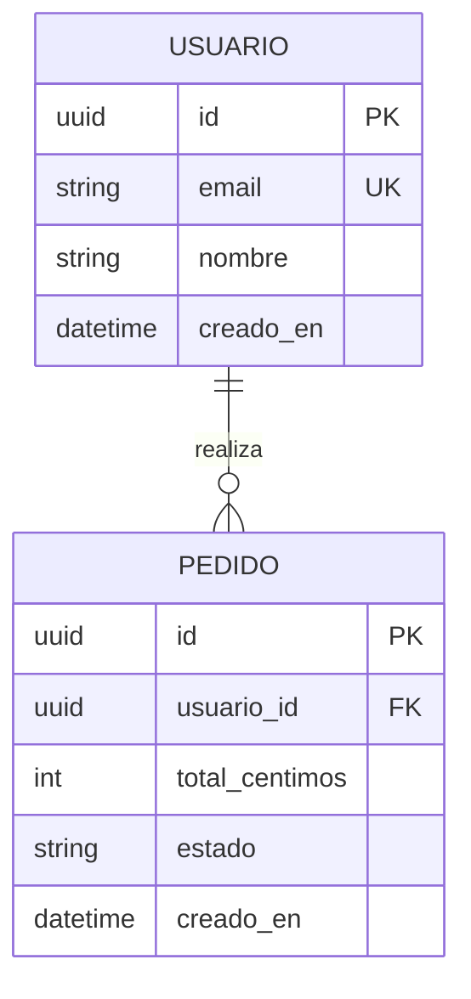

# Modelo de datos · [Nombre del proyecto]

<!-- Fase 3 (opcional). Entidades, relaciones y reglas. Se mantiene sincronizado con las migraciones. -->

## Diagrama

## Entidades
### [Entidad]
| Campo | Tipo | Restricciones | Notas |
|---|---|---|---|
| id | uuid | PK | |
| [ ] | [ ] | [not null · unique · FK → ] | |

Reglas de negocio sobre los datos: [p. ej. "un pedido no cambia de usuario"; "estado sigue la máquina: borrador → pagado → enviado"].

## Índices y consultas frecuentes
| Consulta | Campos | Índice |
|---|---|---|
| [listar pedidos de un usuario por fecha] | usuario_id, creado_en | sí |

## Migraciones
Herramienta: [ ]. Convención: una migración por spec, reversible, nombrada `NNN_descripcion`.

## Datos sensibles y retención
| Dato | Sensibilidad | Cifrado | Retención | Borrado |
|---|---|---|---|---|
| email | personal | en tránsito | mientras la cuenta exista | a petición |
